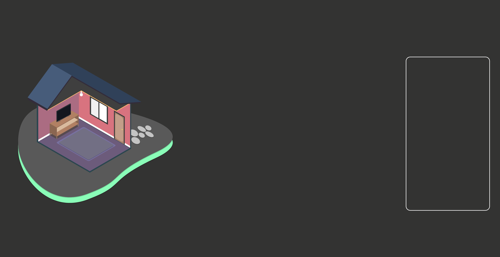

# What we are building ?

Lets build this smarthome appliance-control project using familiar technologies: HTML, CSS, and JavaScript !

Using the knowledge we acquired in the webinar let's identify what components we will use in the project.

Since we are dealing with browser-based application, it wall fall to the "Web Application Component" - this will be composed of HTML, CSS and Vanilla Javascript( Sure enough, we can use JS framewoks as well, but for simplicity, lets go Vanilla !).

## WEB APP - View Layer

Create project directory in your computer by opening a terminal/command prompt.

    mkdir mysimplesmarthome

Navigate to the newly created directory

    cd mysimplesmarthome

Open the project directory with your favorite editor e.g VSCode

create a file called index.html

    touch index.html

Copy and paste this Boilerplate on index.html

    <!DOCTYPE html>
    <html lang="en">
    <head>
        <meta charset="UTF-8" />
        <meta name="viewport" content="width=device-width, initial-scale=1.0" />
        <title>IoT</title>
        <link rel="stylesheet" type="text/css" href="style.css" />
    </head>

    <body>
        

        <svg
            width="100%"
            height="100%"
            viewBox="0 0 1400 1263"
            fill="none"
            xmlns="http://www.w3.org/2000/svg"
        >
            <g id="house">
            <g id="soil">
                <path
                id="Vector 10"
                d="M662.041 1236C-186.759 942.404 -17.6261 649.004 173.041 539.004C434.641 381.404 811.207 365.338 957.541 377.004C1489.54 385.404 1400.54 696.171 1289.54 850.504C985.141 1205.7 744.374 1255.5 662.041 1236Z"
                fill="#8AFDB8"
                />
                <path
                id="Vector 9"
                d="M662.041 1174C-186.759 880.404 -17.6261 587.004 173.041 477.004C434.641 319.404 811.207 303.338 957.541 315.004C1489.54 323.404 1400.54 634.171 1289.54 788.504C985.141 1143.7 744.374 1193.5 662.041 1174Z"
                fill="#595959"
                />
            </g>
            <g id="stones">
                <g id="Ellipse 14" filter="url(#filter0_d)">
                <ellipse
                    cx="1111.31"
                    cy="624.929"
                    rx="39.6496"
                    ry="26.0853"
                    transform="rotate(28.1476 1111.31 624.929)"
                    fill="#C4C4C4"
                />
                </g>
                <g id="Ellipse 18" filter="url(#filter1_d)">
                <ellipse
                    cx="1128"
                    cy="689.621"
                    rx="39.6496"
                    ry="26.0853"
                    transform="rotate(28.1476 1128 689.621)"
                    fill="#C4C4C4"
                />
                </g>
                <g id="Ellipse 15" filter="url(#filter2_d)">
                <ellipse
                    cx="1179.55"
                    cy="591.162"
                    rx="39.6496"
                    ry="18.5569"
                    transform="rotate(28.1476 1179.55 591.162)"
                    fill="#C4C4C4"
                />
                </g>
                <g id="Ellipse 17" filter="url(#filter3_d)">
                <ellipse
                    cx="1245.49"
                    cy="636.029"
                    rx="39.6496"
                    ry="18.5569"
                    transform="rotate(28.1476 1245.49 636.029)"
                    fill="#C4C4C4"
                />
                </g>
                <g id="Ellipse 16" filter="url(#filter4_d)">
                <ellipse
                    cx="1179.41"
                    cy="643.742"
                    rx="28.2645"
                    ry="19.1954"
                    transform="rotate(28.1476 1179.41 643.742)"
                    fill="#C4C4C4"
                />
                </g>
                <g id="Ellipse 19" filter="url(#filter5_d)">
                <ellipse
                    cx="1235.75"
                    cy="582.181"
                    rx="28.2645"
                    ry="19.1954"
                    transform="rotate(28.1476 1235.75 582.181)"
                    fill="#C4C4C4"
                />
                </g>
            </g>
            <g id="floor">
                <rect
                id="Rectangle 30"
                width="521.661"
                height="406.306"
                transform="matrix(0.866025 0.5 -0.865255 0.501333 637.232 498.725)"
                fill="#2B464F"
                />
                <rect
                id="Rectangle 29"
                width="505.704"
                height="397.496"
                transform="matrix(0.866025 0.5 -0.865255 0.501333 642.935 499)"
                fill="#6C5B7B"
                />
            </g>
            <g id="mat">
                <rect
                id="Rectangle 69"
                width="320.803"
                height="271.695"
                rx="12"
                transform="matrix(0.866025 0.5 -0.865255 0.501333 684.496 570.911)"
                fill="#78719F"
                />
                <g id="Rectangle 70" filter="url(#filter6_d)">
                <rect
                    width="294.979"
                    height="249.824"
                    rx="12"
                    transform="matrix(0.866025 0.5 -0.865255 0.501333 687.547 582.181)"
                    fill="#726F84"
                />
                </g>
            </g>
            <rect
                id="tv-stand-shadow"
                width="68.4704"
                height="217.032"
                transform="matrix(0.866025 0.5 -0.865255 0.501333 582.799 533.386)"
                fill="#4F443D"
                fill-opacity="0.7"
            />
            <g id="left-wall">
                <rect
                id="Rectangle 34"
                width="414.603"
                height="400.226"
                transform="matrix(0.866025 -0.5 0.00153952 0.999999 285.051 302.084)"
                fill="#2B464F"
                />
                <rect
                id="Rectangle 31"
                width="399.282"
                height="392.781"
                transform="matrix(0.866025 -0.5 0.00153952 0.999999 297.595 305.57)"
                fill="#AB6C82"
                />
                <rect
                id="Rectangle 35"
                width="398.923"
                height="15.6511"
                transform="matrix(0.866025 -0.5 0.00153952 0.999999 298.175 682.076)"
                fill="white"
                />
            </g>
            <g id="right-wall">
                <rect
                id="Rectangle 33"
                width="408.14"
                height="514.005"
                transform="matrix(0 1 -0.866794 -0.498666 1089.09 351.505)"
                fill="#2B464F"
                />
                <rect
                id="Rectangle 32"
                width="394.311"
                height="504.374"
                transform="matrix(0 1 -0.866794 -0.498666 1080.74 356.902)"
                fill="#D8737F"
                />
                <rect
                id="Rectangle 36"
                width="15.6512"
                height="504.547"
                transform="matrix(0 1 -0.866794 -0.498666 1080.89 735.943)"
                fill="white"
                />
            </g>
            <g id="window">
                <rect
                id="Rectangle 64"
                width="160.728"
                height="178.156"
                transform="matrix(0 1 -0.866794 -0.498666 891.88 393.751)"
                fill="#3C3C3C"
                />
                <rect
                id="Rectangle 65"
                width="136.523"
                height="72.2255"
                transform="matrix(0 1 -0.866794 -0.498666 810.494 361.518)"
                fill="#F1F1F1"
                />
                <rect
                id="Rectangle 66"
                width="136.523"
                height="72.2255"
                transform="matrix(0 1 -0.866794 -0.498666 881.446 401.168)"
                fill="white"
                />
            </g>
            <g id="door">
                <rect
                id="Rectangle 71"
                width="239.289"
                height="105.931"
                transform="matrix(0 1 -0.866794 -0.498666 1034.83 485.511)"
                fill="#3C3C3C"
                />
                <rect
                id="Rectangle 72"
                width="229.411"
                height="89.0781"
                transform="matrix(0 1 -0.866794 -0.498666 1027.52 491.187)"
                fill="#A6806A"
                />
                <rect
                id="Rectangle 73"
                width="211.399"
                height="77.0405"
                rx="19"
                transform="matrix(0 1 -0.866794 -0.498666 1021.26 494.906)"
                fill="#C39E89"
                />
                <circle
                id="Ellipse 20"
                cx="1012.92"
                cy="595.745"
                r="3.67364"
                fill="#EFDB25"
                stroke="#F9F09F"
                />
            </g>
            <g id="bulb">
                <ellipse
                id="Ellipse 13"
                cx="664.938"
                cy="298.373"
                rx="13.0426"
                ry="13.5643"
                fill="white"
                />
                <path
                id="Subtract"
                fill-rule="evenodd"
                clip-rule="evenodd"
                d="M656.371 262.897C656.571 263.461 656.833 264.05 657.163 264.665C664.988 279.266 651.895 292.744 651.895 292.744H677.981C677.981 292.744 664.988 279.266 672.292 264.665C672.6 264.05 672.841 263.461 673.021 262.897H656.371Z"
                fill="#E6E6E6"
                />
            </g>
            <g id="tv-stand">
                <rect
                id="Rectangle 60"
                width="5.34895"
                height="19.2519"
                transform="matrix(0.866025 -0.5 0.00153952 0.999999 637.904 550.668)"
                fill="#A17860"
                />
                <rect
                id="Rectangle 43"
                width="5.34544"
                height="19.2519"
                transform="matrix(0.866025 -0.5 0.00153952 0.999999 454.691 656.849)"
                fill="#A17860"
                />
                <rect
                id="Rectangle 59"
                width="5.34544"
                height="19.7603"
                transform="matrix(0.866025 -0.5 0.00153952 0.999999 400.433 626.082)"
                fill="#A17860"
                />
                <rect
                id="Rectangle 49"
                width="78.6748"
                height="68.6142"
                transform="matrix(0 1 -0.866794 -0.498666 642.505 469.276)"
                fill="#916B55"
                />
                <rect
                id="Rectangle 52"
                width="78.557"
                height="68.6142"
                transform="matrix(0 1 -0.866794 -0.498666 640.418 470.319)"
                fill="#8A6651"
                />
                <rect
                id="Rectangle 61"
                width="19.2044"
                height="6.01879"
                transform="matrix(0 1 -0.866794 -0.498666 638.331 550.75)"
                fill="#646464"
                />
                <rect
                id="Rectangle 53"
                width="68.0239"
                height="217.726"
                transform="matrix(0.866025 0.5 -0.865255 0.501333 583.605 513.962)"
                fill="#916B55"
                />
                <rect
                id="Rectangle 54"
                width="68.5002"
                height="212.618"
                transform="matrix(0.866025 0.5 -0.865255 0.501333 581.484 512.273)"
                fill="#B18063"
                />
                <rect
                id="Rectangle 56"
                width="62.5955"
                height="214.068"
                transform="matrix(0.866025 0.5 -0.865255 0.501333 581.484 484.1)"
                fill="#C3A589"
                />
                <rect
                id="Rectangle 55"
                width="62.5955"
                height="214.068"
                transform="matrix(0.866025 0.5 -0.865255 0.501333 581.484 480.97)"
                fill="#D9BA9D"
                />
                <rect
                id="Rectangle 50"
                width="68.5002"
                height="212.181"
                transform="matrix(0.866025 0.5 -0.865255 0.501333 580.98 440.962)"
                fill="#916B55"
                />
                <rect
                id="Rectangle 51"
                width="71.974"
                height="67.4104"
                transform="matrix(0 1 -0.866794 -0.498666 456.778 581.558)"
                fill="#916B55"
                />
                <rect
                id="Rectangle 44"
                width="79.1756"
                height="68.6142"
                transform="matrix(0 1 -0.866794 -0.498666 454.691 578.011)"
                fill="#8A6651"
                />
                <rect
                id="Rectangle 57"
                width="19.2044"
                height="6.01879"
                transform="matrix(0 1 -0.866794 -0.498666 454.691 657.178)"
                fill="#646464"
                />
                <rect
                id="Rectangle 58"
                width="19.4924"
                height="6.01879"
                transform="matrix(0 1 -0.866794 -0.498666 400.434 625.875)"
                fill="#646464"
                />
                <rect
                id="Rectangle 47"
                width="68.5002"
                height="216.934"
                transform="matrix(0.866025 0.5 -0.865255 0.501333 582.919 435.06)"
                fill="#B18063"
                />
            </g>
            <g id="tv">
                <path
                id="Vector 2"
                d="M548.85 489.932C549.598 485.26 553.117 480.363 554.783 478.498L557.146 477.188C552.701 482.606 550.888 487.318 550.538 488.996C549.641 490.319 549.039 490.171 548.85 489.932Z"
                fill="#2D3039"
                />
                <rect
                id="Rectangle 4"
                width="136.784"
                height="92.9426"
                rx="2"
                transform="matrix(-0.87462 0.48481 0.00388887 0.999992 572.354 371.953)"
                fill="#2C2D30"
                />
                <rect
                id="Rectangle 2"
                width="136.784"
                height="92.9426"
                rx="2"
                transform="matrix(-0.87462 0.48481 0.00388887 0.999992 575.354 373.953)"
                fill="#2D3039"
                />
                <path
                id="Vector 1"
                d="M564.156 481.448C563.374 477.624 559.832 476.641 558.159 476.627L555.796 477.937C560.264 478.414 562.105 481.1 562.467 482.383C563.371 482.708 563.969 481.895 564.156 481.448Z"
                fill="#2D3039"
                />
                <path
                id="Vector 3"
                d="M471.307 532.914C472.056 528.242 475.575 523.345 477.24 521.481L479.604 520.171C475.158 525.589 473.346 530.3 472.995 531.979C472.098 533.301 471.496 533.153 471.307 532.914Z"
                fill="#2D3039"
                />
                <path
                id="Vector 4"
                d="M486.613 524.43C485.831 520.607 482.29 519.623 480.617 519.61L478.253 520.92C482.722 521.397 484.563 524.083 484.925 525.366C485.829 525.69 486.427 524.877 486.613 524.43Z"
                fill="#2D3039"
                />
                <ellipse
                id="Ellipse 1"
                rx="0.643385"
                ry="0.809605"
                transform="matrix(-0.87462 0.48481 0.00388887 0.999992 570.557 467.216)"
                fill="#D81D1D"
                />
                <ellipse
                id="Ellipse 2"
                rx="0.643385"
                ry="0.809605"
                transform="matrix(-0.87462 0.48481 0.00388887 0.999992 568.757 468.215)"
                fill="#D81D1D"
                />
                <ellipse
                id="Ellipse 3"
                rx="0.643385"
                ry="0.809605"
                transform="matrix(-0.87462 0.48481 0.00388887 0.999992 566.956 469.213)"
                fill="#D81D1D"
                />
                <g id="screen">
                <path
                    d="M459.353 444.624L571.488 379.883L571.556 463.154L459.421 527.895L459.353 444.624Z"
                    fill="#EBEBEB"
                />
                <g id="photo">
                    <path
                    id="Vector"
                    d="M552.295 432.139L551.116 439.741L550.158 445.908L549.395 450.827L548.439 456.994L545.313 477.143L506.375 476.265L503.513 476.201L499.89 476.119L497.027 476.054L493.583 475.976L495.532 471.164L497.152 467.163L499.201 462.1L500.821 458.101L519.048 413.082L538.404 424.177L541.851 426.153L544.599 427.728L548.046 429.703L552.295 432.139Z"
                    fill="#F2F2F2"
                    />
                    <path
                    id="Vector_2"
                    d="M495.741 485.153C493.137 484.772 491.515 483.136 490.919 480.29C490.477 478.177 490.602 475.441 491.289 472.156C491.798 469.733 492.563 467.281 493.555 464.89C498.818 452.162 499.288 445.576 498.756 442.293C498.173 438.693 496.287 438.147 496.268 438.142L496.349 437.932C496.369 437.937 498.304 438.493 498.902 442.165C499.246 444.282 499.087 447.014 498.429 450.285C497.61 454.357 496.012 459.284 493.677 464.931C492.694 467.301 491.936 469.731 491.431 472.131C490.304 477.518 490.15 484.113 495.813 484.941L495.741 485.153Z"
                    fill="#2F2E41"
                    />
                    <path
                    id="Vector_3"
                    d="M496.992 484.43C499.593 481.044 501.211 477.537 501.801 474.007C502.24 471.386 502.111 468.796 501.419 466.308C500.906 464.475 500.138 462.908 499.143 461.663C493.865 455.021 493.384 448.985 493.91 445.091C494.487 440.821 496.37 438.099 496.389 438.072L496.307 437.956C496.288 437.984 494.355 440.773 493.765 445.13C493.424 447.643 493.587 450.189 494.25 452.698C495.074 455.821 496.68 458.899 499.021 461.845C500.007 463.078 500.768 464.631 501.277 466.447C502.411 470.528 502.577 476.938 496.92 484.303L496.992 484.43Z"
                    fill="#2F2E41"
                    />
                    <path
                    id="Vector_4"
                    d="M553.708 443.545C551.104 443.164 549.481 441.528 548.886 438.682C548.444 436.57 548.568 433.833 549.255 430.549C549.765 428.126 550.53 425.674 551.522 423.282C556.784 410.554 557.255 403.969 556.723 400.685C556.139 397.085 554.254 396.539 554.235 396.534L554.316 396.325C554.335 396.33 556.271 396.885 556.868 400.557C557.212 402.674 557.053 405.406 556.396 408.678C555.577 412.75 553.978 417.677 551.644 423.324C550.661 425.693 549.903 428.123 549.398 430.524C548.271 435.91 548.116 442.505 553.78 443.334L553.708 443.545Z"
                    fill="#2F2E41"
                    />
                    <path
                    id="Vector_5"
                    d="M554.959 442.823C557.56 439.437 559.178 435.93 559.768 432.4C560.206 429.779 560.078 427.188 559.386 424.7C558.873 422.867 558.105 421.3 557.11 420.056C551.831 413.414 551.351 407.377 551.877 403.483C552.454 399.213 554.337 396.491 554.356 396.464L554.274 396.349C554.255 396.376 552.322 399.165 551.731 403.523C551.391 406.035 551.554 408.581 552.216 411.091C553.041 414.214 554.646 417.291 556.988 420.238C557.974 421.471 558.735 423.024 559.243 424.84C560.378 428.92 560.543 435.33 554.886 442.695L554.959 442.823Z"
                    fill="#2F2E41"
                    />
                    <path
                    id="Vector_6"
                    d="M515.374 444.271C513.415 441.111 509.547 443.144 509.547 443.144C509.547 443.144 505.776 444.695 503.364 452.623C501.115 460.014 498.009 467.689 502.874 466.306L503.749 462.249L504.297 465.749C504.989 465.414 505.684 465.028 506.378 464.593C511.586 461.368 516.547 458.786 516.385 456.452C516.171 453.348 517.259 447.312 515.374 444.271Z"
                    fill="#2F2E41"
                    />
                    <path
                    id="Vector_7"
                    d="M507.356 457.882C508.031 459.428 508.458 461.489 508.714 463.904L514.122 460.342C512.877 458.772 512.462 456.385 512.933 453.125L507.356 457.882Z"
                    fill="#FFB8B8"
                    />
                    <path
                    id="Vector_8"
                    opacity="0.2"
                    d="M507.356 457.882C508.031 459.428 508.458 461.489 508.714 463.904L514.122 460.342C512.877 458.772 512.462 456.385 512.933 453.125L507.356 457.882Z"
                    fill="black"
                    />
                    <path
                    id="Vector_9"
                    d="M482.288 509.211C482.288 509.211 479.49 512.774 480.912 513.616C482.334 514.458 484.208 509.512 484.208 509.512L482.288 509.211Z"
                    fill="#FFB8B8"
                    />
                    <path
                    id="Vector_10"
                    d="M516.509 483.774L516.468 486.459L516.379 492.26L516.379 492.261L516.353 493.941L498.45 504.277L499.173 498.612L499.174 498.607L499.822 493.536L500.111 491.266L500.111 491.265L514.815 480.141L516.509 483.774Z"
                    fill="#2F2E41"
                    />
                    <path
                    id="Vector_11"
                    d="M516.509 483.774L516.467 486.459C511.264 489.29 503.198 492.316 499.822 493.536L500.111 491.266L514.815 480.142L516.509 483.774Z"
                    fill="#3F3D56"
                    />
                    <path
                    id="Vector_12"
                    d="M509.977 458.234C512.311 456.887 514.201 453.338 514.199 450.308C514.196 447.278 512.302 445.914 509.968 447.262C507.634 448.609 505.744 452.158 505.747 455.188C505.749 458.218 507.643 459.582 509.977 458.234Z"
                    fill="#FFB8B8"
                    />
                    <path
                    id="Vector_13"
                    d="M518.117 485.81C518.117 485.81 518.629 491.442 515.586 492.76L515.074 487.128L512.367 485.178L504.76 489.35L499.187 499.374C499.187 499.374 499.012 492.449 499.688 491.4C500.364 490.351 501.884 487.937 501.884 487.937L501.883 486.84L497.309 477.405C497.309 477.405 500.008 468.601 502.205 467.113L505.078 465.234C505.078 465.234 506.092 463.99 506.092 463.771C506.092 463.551 505.921 461.893 506.767 461.844C506.767 461.844 506.841 459.549 507.732 459.721C507.732 459.721 510.539 460.955 513.384 456.584C513.384 456.584 514.71 455.502 514.542 456.477C514.374 457.453 514.543 458.013 514.881 457.818C515.219 457.623 516.741 457.403 516.742 457.842C516.742 457.936 516.852 458.781 517.026 460.049L517.026 460.051C517.657 464.673 519.123 474.91 519.123 474.91C519.123 474.91 520.647 476.884 518.117 485.81Z"
                    fill="#6C63FF"
                    />
                    <path
                    id="Vector_14"
                    d="M498.491 475.624L497.309 477.405L486.505 501.646L480.763 510.889C480.763 510.889 483.974 508.377 483.3 512.278L503.066 486.156L498.491 475.624Z"
                    fill="#6C63FF"
                    />
                    <path
                    id="Vector_15"
                    d="M517.026 460.049L517.026 460.051C516.803 461.897 509.476 465.769 508.462 466.355C507.448 466.94 506.602 467.209 505.587 466.917C504.572 466.624 505.078 465.234 505.078 465.234C505.078 465.234 505.941 463.882 505.941 463.662C505.941 463.443 505.771 461.785 506.616 461.736C506.616 461.736 506.69 459.44 507.582 459.613C507.582 459.613 510.539 460.955 513.384 456.584C513.384 456.584 514.71 455.502 514.542 456.477C514.374 457.453 514.543 458.013 514.881 457.818C515.219 457.623 516.741 457.403 516.742 457.842C516.742 457.936 516.852 458.781 517.026 460.049Z"
                    fill="#3F3D56"
                    />
                    <path
                    id="Vector_16"
                    d="M516.145 452.368C516.145 452.368 514.79 449.418 513.439 451.954C512.088 454.491 514.964 455.465 514.964 455.465L516.145 452.368Z"
                    fill="#FFB8B8"
                    />
                    <path
                    id="Vector_17"
                    d="M516.145 451.49C516.145 451.49 514.059 456.122 513.413 456.757C513.413 456.757 515.31 465.365 517.679 466.632L519.039 474.849C519.039 474.849 524.784 468.458 523.427 464.191C523.414 464.149 523.4 464.106 523.387 464.064C522.254 460.513 520.693 457.425 518.744 454.882L516.145 451.49Z"
                    fill="#6C63FF"
                    />
                    <path
                    id="Vector_18"
                    opacity="0.2"
                    d="M515.037 462.296L519.208 474.751L517.679 466.632L515.037 462.296Z"
                    fill="black"
                    />
                    <path
                    id="Vector_19"
                    d="M514.509 444.357L510.685 443.964L505.408 448.074L504.321 454.966L507.039 453.261L507.797 450.522L507.799 452.785L509.053 451.998L509.778 447.915L510.236 451.551L514.695 448.859L514.509 444.357Z"
                    fill="#2F2E41"
                    />
                    <path
                    id="Vector_20"
                    d="M550.641 457.284L552.818 466.074C552.818 466.074 552.378 475.227 554.462 472.283C556.595 469.27 555.795 462.228 555.795 462.228L554.538 453.94L550.641 457.284Z"
                    fill="#A0616A"
                    />
                    <path
                    id="Vector_21"
                    d="M551.777 428.445L553.57 429.736L553.579 440.813C553.579 440.813 554.634 442.256 554.424 442.924C554.213 443.593 554.003 443.715 554.214 444.003C554.425 444.292 554.636 444.444 554.425 444.839C554.215 445.234 554.215 445.918 554.426 446.07C554.637 446.221 555.059 446.388 554.743 446.981C554.427 447.574 554.006 447.544 554.428 448.805C554.851 450.066 555.589 450.05 555.378 450.719C555.168 451.387 555.169 452.755 555.169 452.755L550.641 456.19L549.68 441.285L551.777 428.445Z"
                    fill="#D0CDE1"
                    />
                    <path
                    id="Vector_22"
                    d="M555.38 452.496L550.113 455.811L550.326 458.561L554.96 454.791L555.38 452.496Z"
                    fill="#3F3D56"
                    />
                    <path
                    id="Vector_23"
                    d="M540.863 420.449L540.238 429.019L546.664 426.54L547.135 421.549L547.605 416.557L540.863 420.449Z"
                    fill="#A0616A"
                    />
                    <path
                    id="Vector_24"
                    opacity="0.1"
                    d="M540.863 420.405L540.238 428.974L546.664 426.496L547.135 421.504L547.605 416.512L540.863 420.405Z"
                    fill="black"
                    />
                    <path
                    id="Vector_25"
                    d="M526.938 467.549L530.528 475.464C530.528 475.464 531.164 479.748 532.112 479.338C533.06 478.927 534.004 473.457 534.004 473.457L532.738 471.589L531.257 465.055L526.938 467.549Z"
                    fill="#A0616A"
                    />
                    <path
                    id="Vector_26"
                    d="M551.471 473.762L531.223 485.452C531.381 482.065 531.48 479.976 531.48 479.976L531.749 479.271L533.05 475.859L533.98 473.422L534.304 472.572L534.424 472.257L535.699 471.218L548.852 460.506C549.071 461.646 549.38 462.704 549.775 463.667C549.865 463.88 549.962 464.089 550.065 464.292C550.396 464.939 550.801 465.5 551.281 465.808C551.39 465.878 551.47 466.187 551.521 466.703C551.649 467.967 551.615 470.473 551.471 473.762Z"
                    fill="#2F2E41"
                    />
                    <path
                    id="Vector_27"
                    d="M544.394 421.078C547.186 419.466 549.448 415.221 549.445 411.595C549.442 407.97 547.176 406.338 544.383 407.951C541.591 409.563 539.33 413.808 539.333 417.434C539.336 421.059 541.602 422.691 544.394 421.078Z"
                    fill="#A0616A"
                    />
                    <path
                    id="Vector_28"
                    d="M533.129 434.423L532.391 434.302C532.391 434.302 529.128 439.059 528.08 446.094C527.032 453.129 526.296 455.196 526.296 455.196C526.296 455.196 525.243 456.078 525.981 456.609C526.719 457.141 526.719 457.004 526.088 457.916C525.456 458.828 525.034 457.977 525.456 458.828C525.878 459.679 526.405 459.101 525.984 460.028C525.563 460.955 524.826 461.381 525.248 461.684C525.669 461.988 524.828 463.705 525.355 463.948C525.882 464.191 526.093 464.206 526.093 465.164C526.091 465.724 526.162 466.238 526.305 466.683L531.783 463.521C531.783 463.521 530.727 461.531 531.043 460.801C531.358 460.072 531.463 459.464 531.252 459.312C531.042 459.16 530.41 460.072 531.041 459.023C531.673 457.975 531.884 458.263 531.673 457.565C531.461 456.866 531.04 457.519 531.461 456.866C531.882 456.212 532.198 456.166 531.987 455.878C531.776 455.589 531.355 455.832 531.776 455.316C532.197 454.799 532.513 454.89 532.408 454.267C532.302 453.644 532.197 453.978 532.407 453.583C532.617 453.188 534.822 442.612 534.822 442.339C534.821 442.065 533.129 434.423 533.129 434.423Z"
                    fill="#D0CDE1"
                    />
                    <path
                    id="Vector_29"
                    d="M532.098 462.791L525.463 467.17L527.15 468.248L531.785 465.709L532.098 462.791Z"
                    fill="#3F3D56"
                    />
                    <path
                    id="Vector_30"
                    d="M534.003 471.953L532.636 476.025C532.636 476.025 536.745 474.337 538.22 474.17C539.695 474.002 543.488 472.77 543.488 472.77L544.432 467.436L534.003 471.953Z"
                    fill="#3F3D56"
                    />
                    <path
                    id="Vector_31"
                    d="M546.012 466.524L547.174 470.368L551.808 466.461L551.278 462.526L546.012 466.524Z"
                    fill="#3F3D56"
                    />
                    <path
                    id="Vector_32"
                    d="M547.872 421.26C547.872 421.26 547.556 421.168 546.819 422.141C546.082 423.114 543.66 424.786 542.5 423.814C541.34 422.842 540.496 421.961 540.18 422.417C539.864 422.873 539.656 426.14 539.656 426.14L538.604 427.842L532.391 434.302L532.933 452.459L533.885 456.151C533.885 456.151 533.15 459.858 534.099 461.225C535.049 462.593 533.575 464.128 533.575 464.128C533.575 464.128 533.259 464.857 533.471 466.103C533.683 467.349 533.266 472.652 533.266 472.652C533.266 472.652 542.223 472.679 551.594 462.754L550.537 458.166L550.001 446.846C550.001 446.846 550.526 444.627 550.42 443.868C550.314 443.108 553.57 429.736 553.57 429.736C553.57 429.736 553.038 424.297 550.299 424.647C547.559 424.997 547.137 424.01 547.137 424.01C547.137 424.01 548.399 421.502 547.872 421.26Z"
                    fill="#D0CDE1"
                    />
                    <path
                    id="Vector_33"
                    d="M539.298 418.295C539.298 418.295 538.773 417.575 538.974 416.358C539.094 415.663 539.141 414.99 539.113 414.362C539.113 414.362 539.536 412.335 539.959 411.094C540.383 409.853 540.18 409.55 541.513 408.466C542.845 407.382 542.298 405.442 545.814 405.851C545.933 405.998 546.098 406.067 546.288 406.05C546.479 406.034 546.686 405.932 546.885 405.758C547.611 405.154 547.875 406.314 547.875 406.314C547.875 406.314 548.359 405.667 548.542 406.086C548.724 406.506 550.019 404.918 550.022 408.458C550.025 411.997 548.553 416.01 548.553 416.01C548.553 416.01 548.656 409.994 546.252 410.778C543.849 411.563 541.263 411.299 540.638 413.915C540.014 416.531 539.298 418.295 539.298 418.295Z"
                    fill="#2F2E41"
                    />
                    <path
                    id="Vector_34"
                    d="M548.604 414.338C548.866 414.187 549.078 413.697 549.077 413.244C549.077 412.791 548.865 412.546 548.603 412.697C548.341 412.848 548.129 413.338 548.129 413.791C548.13 414.245 548.342 414.489 548.604 414.338Z"
                    fill="#A0616A"
                    />
                    <path
                    id="W"
                    d="M489.205 432.056L485.599 446.744L483.448 447.986L480.743 440.219L478.008 451.127L475.841 452.378L472.214 441.866L474.318 440.651L477.039 448.661L479.852 437.456L481.723 436.376L484.49 444.413L487.272 433.172L489.205 432.056Z"
                    fill="#756EEC"
                    fill-opacity="0.8"
                    />
                    <path
                    id="W_2"
                    d="M489.924 431.641L486.318 446.329L484.167 447.571L481.462 439.804L478.726 450.712L476.56 451.963L472.933 441.451L475.037 440.236L477.757 448.246L480.571 437.041L482.442 435.961L485.209 443.998L487.991 432.757L489.924 431.641Z"
                    fill="#F00D0D"
                    fill-opacity="0.69"
                    />
                </g>
                </g>
            </g>
            <g id="couch">
                <rect
                id="shadow"
                width="71.6159"
                height="244.783"
                transform="matrix(0.866025 0.5 -0.865255 0.501333 867.979 690.232)"
                fill="#4F443D"
                fill-opacity="0.7"
                />
                <rect
                id="Rectangle 38"
                width="4.31496"
                height="27.9436"
                transform="matrix(0.841257 -0.540636 0.00138308 0.999999 924.81 701.35)"
                fill="#DEC48F"
                />
                <rect
                id="Rectangle 33_2"
                width="49.2325"
                height="72.5759"
                transform="matrix(0 1 -0.866794 -0.498666 907.012 666.167)"
                fill="#9C7E52"
                />
                <rect
                id="Rectangle 29_2"
                width="37.7768"
                height="171.518"
                transform="matrix(0.866025 0.5 -0.865255 0.501333 844.178 653.334)"
                fill="#BD9D74"
                />
                <g id="pillow" filter="url(#filter7_d)">
                <ellipse
                    id="Ellipse 21"
                    rx="15.2929"
                    ry="14.7852"
                    transform="matrix(0.948692 0.316203 -0.707138 0.707076 737.618 731.826)"
                    fill="#E5E4E4"
                />
                </g>
                <g id="pillow_2" filter="url(#filter8_d)">
                <ellipse
                    id="Ellipse 21_2"
                    rx="15.2929"
                    ry="14.7852"
                    transform="matrix(0.948692 0.316203 -0.707138 0.707076 770.06 713.831)"
                    fill="#E5E4E4"
                />
                </g>
                <g id="pillow_3" filter="url(#filter9_d)">
                <ellipse
                    id="Ellipse 21_3"
                    rx="15.2929"
                    ry="14.7852"
                    transform="matrix(0.948692 0.316203 -0.707138 0.707076 802.502 695.835)"
                    fill="#E5E4E4"
                />
                </g>
                <g id="pillow_4" filter="url(#filter10_d)">
                <ellipse
                    id="Ellipse 21_4"
                    rx="15.2929"
                    ry="14.7852"
                    transform="matrix(0.948692 0.316203 -0.707138 0.707076 834.943 677.84)"
                    fill="#E5E4E4"
                />
                </g>
                <g id="Subtract_2">
                <path
                    fill-rule="evenodd"
                    clip-rule="evenodd"
                    d="M929.415 655.07L865.209 618L843.653 630.49L886.039 654.961L718.092 752.271L675.705 727.799L655 739.796L719.206 776.865L929.415 655.07Z"
                    fill="#C7B286"
                />
                <path
                    fill-rule="evenodd"
                    clip-rule="evenodd"
                    d="M929.415 655.07L865.209 618L843.653 630.49L886.039 654.961L718.092 752.271L675.705 727.799L655 739.796L719.206 776.865L929.415 655.07Z"
                    fill="#C7B286"
                />
                </g>
                <rect
                id="Rectangle 39"
                width="27.0741"
                height="3.83084"
                transform="matrix(0 1 -0.84213 -0.539274 924.755 702.435)"
                fill="#97764C"
                />
                <rect
                id="Rectangle 31_2"
                width="242.55"
                height="47.7354"
                transform="matrix(0.866025 -0.5 0.00153952 0.999999 718.359 777.293)"
                fill="#DEC48F"
                />
                <rect
                id="Rectangle 34_2"
                width="4.72881"
                height="27.9437"
                transform="matrix(0.866025 -0.5 0.00153952 0.999999 718.287 821.065)"
                fill="#DEC48F"
                />
                <rect
                id="Rectangle 36_2"
                width="4.72881"
                height="27.9437"
                transform="matrix(0.866025 -0.5 0.00153952 0.999999 660.218 787.191)"
                fill="#DEC48F"
                />
                <rect
                id="Rectangle 32_2"
                width="49.2325"
                height="72.5759"
                transform="matrix(0 1 -0.866794 -0.498666 718.287 776.264)"
                fill="#97764C"
                />
                <rect
                id="Rectangle 35_2"
                width="27.0741"
                height="5.58276"
                transform="matrix(0 1 -0.866794 -0.498666 718.287 822.207)"
                fill="#97764C"
                />
                <rect
                id="Rectangle 37"
                width="27.0741"
                height="5.58276"
                transform="matrix(0 1 -0.866794 -0.498666 660.218 788.333)"
                fill="#97764C"
                />
            </g>
            <rect
                id="tvscreen"
                width="130.607"
                height="84.4026"
                transform="matrix(-0.87462 0.48481 0.00388887 0.999992 572.669 379.498)"
                fill="#13161E"
            />
            <path
                id="light"
                fill-rule="evenodd"
                clip-rule="evenodd"
                d="M1079.46 362.038V755.603L1076.8 754.074L731.75 954L297 702.997L298.405 702.183L297.803 310.804L642.937 111.541L643.101 218.624V111L1079.46 362.038Z"
                fill="black"
                fill-opacity="0.5"
            />
            <g id="ceil">
                <rect
                id="Rectangle 45"
                width="191.422"
                height="518.889"
                transform="matrix(0.866025 0.5 -0.865255 0.501333 660.51 77.3708)"
                fill="#FCBB6D"
                />
                <rect
                id="Rectangle 48"
                width="191.422"
                height="518.889"
                transform="matrix(0.866025 0.5 -0.865255 0.501333 660.51 72.1538)"
                fill="#3F3F3F"
                />
                <rect
                id="Rectangle 63"
                width="346.507"
                height="136.94"
                transform="matrix(0.866025 0.5 -0.865255 0.501333 782.74 199.155)"
                fill="#FCBB6D"
                />
                <rect
                id="Rectangle 62"
                width="353.128"
                height="136.94"
                transform="matrix(0.866025 0.5 -0.865255 0.501333 776.968 189.629)"
                fill="#3F3F3F"
                />
            </g>
            <g id="roof">
                <rect
                id="Rectangle 40"
                width="671.884"
                height="180.851"
                transform="matrix(-0.867667 -0.497147 0.997437 -0.0715547 995.517 382.4)"
                fill="#332C3A"
                />
                <rect
                id="Rectangle 37_2"
                width="671.884"
                height="180.851"
                transform="matrix(-0.867667 -0.497147 0.997437 -0.0715547 995.517 371.965)"
                fill="#304159"
                />
                <rect
                id="Rectangle 39_2"
                width="191.424"
                height="357.92"
                transform="matrix(-0.866025 -0.5 0.590149 -0.807294 373.181 435.581)"
                fill="#332C3A"
                />
                <rect
                id="Rectangle 38_2"
                width="194.569"
                height="351.256"
                transform="matrix(-0.866025 -0.5 0.590149 -0.807294 375.905 418.862)"
                fill="#475C7A"
                />
            </g>
            </g>
            <defs>
            <filter
                id="filter0_d"
                x="1060.04"
                y="583.224"
                width="102.532"
                height="91.4096"
                filterUnits="userSpaceOnUse"
                color-interpolation-filters="sRGB"
            >
                <feFlood flood-opacity="0" result="BackgroundImageFix" />
                <feColorMatrix
                in="SourceAlpha"
                type="matrix"
                values="0 0 0 0 0 0 0 0 0 0 0 0 0 0 0 0 0 0 127 0"
                />
                <feOffset dy="4" />
                <feGaussianBlur stdDeviation="2" />
                <feColorMatrix
                type="matrix"
                values="0 0 0 0 0 0 0 0 0 0 0 0 0 0 0 0 0 0 0.25 0"
                />
                <feBlend
                mode="normal"
                in2="BackgroundImageFix"
                result="effect1_dropShadow"
                />
                <feBlend
                mode="normal"
                in="SourceGraphic"
                in2="effect1_dropShadow"
                result="shape"
                />
            </filter>
            <filter
                id="filter1_d"
                x="1076.74"
                y="647.916"
                width="102.532"
                height="91.4096"
                filterUnits="userSpaceOnUse"
                color-interpolation-filters="sRGB"
            >
                <feFlood flood-opacity="0" result="BackgroundImageFix" />
                <feColorMatrix
                in="SourceAlpha"
                type="matrix"
                values="0 0 0 0 0 0 0 0 0 0 0 0 0 0 0 0 0 0 127 0"
                />
                <feOffset dy="4" />
                <feGaussianBlur stdDeviation="2" />
                <feColorMatrix
                type="matrix"
                values="0 0 0 0 0 0 0 0 0 0 0 0 0 0 0 0 0 0 0.25 0"
                />
                <feBlend
                mode="normal"
                in2="BackgroundImageFix"
                result="effect1_dropShadow"
                />
                <feBlend
                mode="normal"
                in="SourceGraphic"
                in2="effect1_dropShadow"
                result="shape"
                />
            </filter>
            <filter
                id="filter2_d"
                x="1131.84"
                y="556.096"
                width="95.4291"
                height="78.1335"
                filterUnits="userSpaceOnUse"
                color-interpolation-filters="sRGB"
            >
                <feFlood flood-opacity="0" result="BackgroundImageFix" />
                <feColorMatrix
                in="SourceAlpha"
                type="matrix"
                values="0 0 0 0 0 0 0 0 0 0 0 0 0 0 0 0 0 0 127 0"
                />
                <feOffset dy="4" />
                <feGaussianBlur stdDeviation="2" />
                <feColorMatrix
                type="matrix"
                values="0 0 0 0 0 0 0 0 0 0 0 0 0 0 0 0 0 0 0.25 0"
                />
                <feBlend
                mode="normal"
                in2="BackgroundImageFix"
                result="effect1_dropShadow"
                />
                <feBlend
                mode="normal"
                in="SourceGraphic"
                in2="effect1_dropShadow"
                result="shape"
                />
            </filter>
            <filter
                id="filter3_d"
                x="1197.77"
                y="600.962"
                width="95.4291"
                height="78.1335"
                filterUnits="userSpaceOnUse"
                color-interpolation-filters="sRGB"
            >
                <feFlood flood-opacity="0" result="BackgroundImageFix" />
                <feColorMatrix
                in="SourceAlpha"
                type="matrix"
                values="0 0 0 0 0 0 0 0 0 0 0 0 0 0 0 0 0 0 127 0"
                />
                <feOffset dy="4" />
                <feGaussianBlur stdDeviation="2" />
                <feColorMatrix
                type="matrix"
                values="0 0 0 0 0 0 0 0 0 0 0 0 0 0 0 0 0 0 0.25 0"
                />
                <feBlend
                mode="normal"
                in2="BackgroundImageFix"
                result="effect1_dropShadow"
                />
                <feBlend
                mode="normal"
                in="SourceGraphic"
                in2="effect1_dropShadow"
                result="shape"
                />
            </filter>
            <filter
                id="filter4_d"
                x="1141.43"
                y="613.483"
                width="75.9543"
                height="68.5178"
                filterUnits="userSpaceOnUse"
                color-interpolation-filters="sRGB"
            >
                <feFlood flood-opacity="0" result="BackgroundImageFix" />
                <feColorMatrix
                in="SourceAlpha"
                type="matrix"
                values="0 0 0 0 0 0 0 0 0 0 0 0 0 0 0 0 0 0 127 0"
                />
                <feOffset dy="4" />
                <feGaussianBlur stdDeviation="2" />
                <feColorMatrix
                type="matrix"
                values="0 0 0 0 0 0 0 0 0 0 0 0 0 0 0 0 0 0 0.25 0"
                />
                <feBlend
                mode="normal"
                in2="BackgroundImageFix"
                result="effect1_dropShadow"
                />
                <feBlend
                mode="normal"
                in="SourceGraphic"
                in2="effect1_dropShadow"
                result="shape"
                />
            </filter>
            <filter
                id="filter5_d"
                x="1197.77"
                y="551.922"
                width="75.9543"
                height="68.5178"
                filterUnits="userSpaceOnUse"
                color-interpolation-filters="sRGB"
            >
                <feFlood flood-opacity="0" result="BackgroundImageFix" />
                <feColorMatrix
                in="SourceAlpha"
                type="matrix"
                values="0 0 0 0 0 0 0 0 0 0 0 0 0 0 0 0 0 0 127 0"
                />
                <feOffset dy="4" />
                <feGaussianBlur stdDeviation="2" />
                <feColorMatrix
                type="matrix"
                values="0 0 0 0 0 0 0 0 0 0 0 0 0 0 0 0 0 0 0.25 0"
                />
                <feBlend
                mode="normal"
                in2="BackgroundImageFix"
                result="effect1_dropShadow"
                />
                <feBlend
                mode="normal"
                in="SourceGraphic"
                in2="effect1_dropShadow"
                result="shape"
                />
            </filter>
            <filter
                id="filter6_d"
                x="473.471"
                y="585.7"
                width="467.451"
                height="273.696"
                filterUnits="userSpaceOnUse"
                color-interpolation-filters="sRGB"
            >
                <feFlood flood-opacity="0" result="BackgroundImageFix" />
                <feColorMatrix
                in="SourceAlpha"
                type="matrix"
                values="0 0 0 0 0 0 0 0 0 0 0 0 0 0 0 0 0 0 127 0"
                />
                <feOffset dy="4" />
                <feGaussianBlur stdDeviation="2" />
                <feColorMatrix
                type="matrix"
                values="0 0 0 0 0 0 0 0 0 0 0 0 0 0 0 0 0 0 0.25 0"
                />
                <feBlend
                mode="normal"
                in2="BackgroundImageFix"
                result="effect1_dropShadow"
                />
                <feBlend
                mode="normal"
                in="SourceGraphic"
                in2="effect1_dropShadow"
                result="shape"
                />
            </filter>
            <filter
                id="filter7_d"
                x="715.734"
                y="718.305"
                width="43.7685"
                height="31.0425"
                filterUnits="userSpaceOnUse"
                color-interpolation-filters="sRGB"
            >
                <feFlood flood-opacity="0" result="BackgroundImageFix" />
                <feColorMatrix
                in="SourceAlpha"
                type="matrix"
                values="0 0 0 0 0 0 0 0 0 0 0 0 0 0 0 0 0 0 127 0"
                />
                <feOffset dy="2" />
                <feGaussianBlur stdDeviation="2" />
                <feColorMatrix
                type="matrix"
                values="0 0 0 0 0 0 0 0 0 0 0 0 0 0 0 0 0 0 0.25 0"
                />
                <feBlend
                mode="normal"
                in2="BackgroundImageFix"
                result="effect1_dropShadow"
                />
                <feBlend
                mode="normal"
                in="SourceGraphic"
                in2="effect1_dropShadow"
                result="shape"
                />
            </filter>
            <filter
                id="filter8_d"
                x="748.176"
                y="700.31"
                width="43.7685"
                height="31.0425"
                filterUnits="userSpaceOnUse"
                color-interpolation-filters="sRGB"
            >
                <feFlood flood-opacity="0" result="BackgroundImageFix" />
                <feColorMatrix
                in="SourceAlpha"
                type="matrix"
                values="0 0 0 0 0 0 0 0 0 0 0 0 0 0 0 0 0 0 127 0"
                />
                <feOffset dy="2" />
                <feGaussianBlur stdDeviation="2" />
                <feColorMatrix
                type="matrix"
                values="0 0 0 0 0 0 0 0 0 0 0 0 0 0 0 0 0 0 0.25 0"
                />
                <feBlend
                mode="normal"
                in2="BackgroundImageFix"
                result="effect1_dropShadow"
                />
                <feBlend
                mode="normal"
                in="SourceGraphic"
                in2="effect1_dropShadow"
                result="shape"
                />
            </filter>
            <filter
                id="filter9_d"
                x="780.617"
                y="682.314"
                width="43.7685"
                height="31.0425"
                filterUnits="userSpaceOnUse"
                color-interpolation-filters="sRGB"
            >
                <feFlood flood-opacity="0" result="BackgroundImageFix" />
                <feColorMatrix
                in="SourceAlpha"
                type="matrix"
                values="0 0 0 0 0 0 0 0 0 0 0 0 0 0 0 0 0 0 127 0"
                />
                <feOffset dy="2" />
                <feGaussianBlur stdDeviation="2" />
                <feColorMatrix
                type="matrix"
                values="0 0 0 0 0 0 0 0 0 0 0 0 0 0 0 0 0 0 0.25 0"
                />
                <feBlend
                mode="normal"
                in2="BackgroundImageFix"
                result="effect1_dropShadow"
                />
                <feBlend
                mode="normal"
                in="SourceGraphic"
                in2="effect1_dropShadow"
                result="shape"
                />
            </filter>
            <filter
                id="filter10_d"
                x="813.059"
                y="664.319"
                width="43.7685"
                height="31.0425"
                filterUnits="userSpaceOnUse"
                color-interpolation-filters="sRGB"
            >
                <feFlood flood-opacity="0" result="BackgroundImageFix" />
                <feColorMatrix
                in="SourceAlpha"
                type="matrix"
                values="0 0 0 0 0 0 0 0 0 0 0 0 0 0 0 0 0 0 127 0"
                />
                <feOffset dy="2" />
                <feGaussianBlur stdDeviation="2" />
                <feColorMatrix
                type="matrix"
                values="0 0 0 0 0 0 0 0 0 0 0 0 0 0 0 0 0 0 0.25 0"
                />
                <feBlend
                mode="normal"
                in2="BackgroundImageFix"
                result="effect1_dropShadow"
                />
                <feBlend
                mode="normal"
                in="SourceGraphic"
                in2="effect1_dropShadow"
                result="shape"
                />
            </filter>
            </defs>
        </svg>
        

        

        <h1>IoT Events</h1>
        

        

        

        
        

    </body>
    </html>

## WEB APP - Styling with CSS

On your root project folder, create a file called style.css

    touch style.css

Copy and Paste this CSS Rules on style.css file

    @import url('https://fonts.googleapis.com/css2?family=Montserrat&display=swap');

    * {
        box-sizing: border-box;
        font-family: 'Montserrat', sans-serif;
    }

    body {
        margin: 0;
        padding: 0;
        width: 100%;
        height: 100vh;
        display: flex;
        align-items: center;
        justify-content: center;
        color: whitesmoke;
        background-color: #434343;
    }

    .container {
        width: 98vh;
        height: 98vh;
    }

    .logo {
        position: fixed;
        left: 1em;
        bottom: 1em;
        width: 200px;
    }

    .logo img {
        width: inherit;
    }

    .logs {
        padding: 1em;
        display: flex;
        flex-direction: column;
        width: 300px;
        height: 75vh;
        border: 2px solid grey;
        border-radius: 1em;

        overflow-y: auto;
    }

    .logs p {
        margin: 0;
    }

## WEB APP - Script

In order for us to change the state of something in our view layer, we need some sort of programming interface to communicate to the browser. JavaScript gives us the ability to interact with the various browser API like changing DOM elements at runtime.
